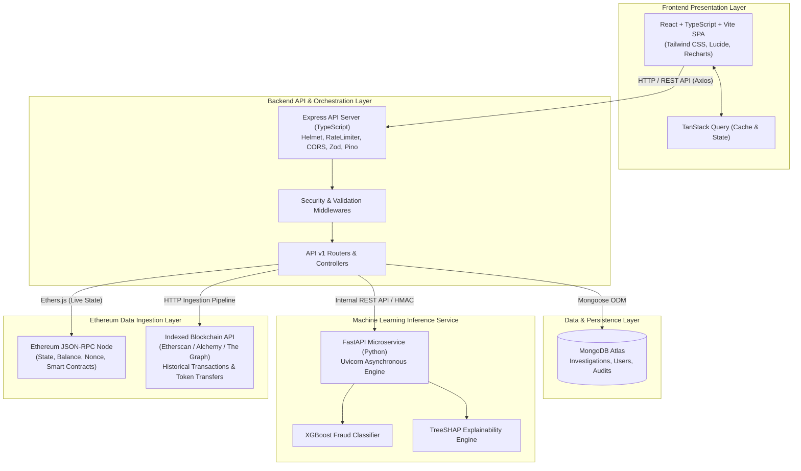
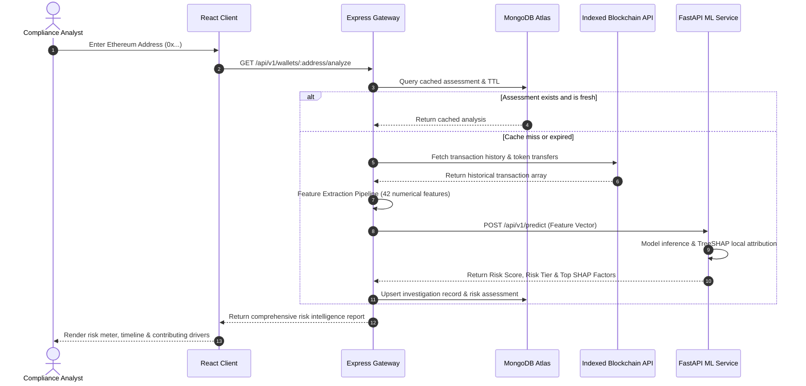

# Ethereum Fraud Detection & Risk Intelligence Platform
## Architectural Blueprint & System Design

---

## 1. High-Level Architecture Overview

The **Ethereum Fraud Detection & Risk Intelligence Platform** is engineered as a decoupled, multi-tier distributed system designed for resilience, modularity, and high-throughput analytical query capabilities.

The platform architecture follows a clear separation of concerns across presentation, orchestration, persistence, analytical inference, and decentralized network data acquisition:

---

## 2. Subsystem Breakdown

### 2.1 Frontend Presentation Layer (`client/`)
* **Technology**: React, TypeScript, Vite, Tailwind CSS, TanStack Query, React Router, Recharts, Lucide Icons.
* **Role**: Provides a clean, dark-themed, cybersecurity-oriented dashboard.
* **Responsibilities**:
  - Wallet search, live query execution, and risk tier visualization.
  - Interactive radar and bar charts for behavioral metrics and SHAP feature attribution.
  - Case management interface for forensic investigations and compliance audits.
  - Real-time connectivity and liveness monitoring of backend services.

### 2.2 Backend Orchestration Layer (`server/`)
* **Technology**: Node.js LTS, Express, TypeScript, Mongoose, Zod, Pino, Helmet, `express-rate-limit`.
* **Role**: Central API gateway, business logic orchestrator, and security perimeter.
* **Responsibilities**:
  - Request validation and sanitization using Zod.
  - Structured request logging with automated redaction of tokens and keys.
  - Orchestrates calls to blockchain data sources and ML inference microservices.
  - Persists analysis records and maintains audit trails.
  - Provides system health (`/api/v1/health`) and readiness (`/api/v1/ready`) probes.

### 2.3 Machine Learning Inference Service (`ml-service/`)
* **Technology**: Python 3.13 / 3.12, FastAPI, Uvicorn, Pandas, NumPy, scikit-learn, XGBoost, SHAP, Joblib.
* **Role**: Computes statistical risk probabilities and transparent explainability metrics for transaction vectors.
* **Responsibilities**:
  - Exposes low-latency inference endpoints (`POST /api/v1/predict/wallet`).
  - Evaluates preprocessed transaction behavioral features against serialized XGBoost models.
  - Computes exact local Shapley values via TreeSHAP to provide human-readable explanations of flagged risk factors (e.g., abnormally high token churn, sudden liquidation, or zero-history contract creation).

### 2.4 Persistence Layer (MongoDB Atlas)
* **Technology**: MongoDB Atlas with Mongoose ODM.
* **Role**: Document store for persistent analytics, cached feature vectors, and application state.
* **Responsibilities**:
  - Persisting investigation dossiers, flagged address tags, and analyst notes.
  - Caching historical transaction metrics to eliminate redundant external blockchain indexing calls.
  - Storing user access credentials and audit logging.

---

## 3. The Blockchain Data Ingestion Dilemma: Standard JSON-RPC vs. Indexed APIs

### 3.1 Why a Standard Ethereum JSON-RPC Provider is Insufficient
Standard Ethereum nodes (Geth, Nethermind, Besu) implement the official Ethereum JSON-RPC specification. These nodes organize data strictly by **blocks and state tries**:
- A node maintains blocks, block headers, transaction receipts, and the current world state trie (account balances, nonces, code hashes, storage roots).
- Standard RPC calls include:
  - `eth_getBalance(address, blockNumber)`: Returns current balance.
  - `eth_getTransactionCount(address, blockNumber)`: Returns current nonce.
  - `eth_getBlockByNumber(blockNumber, fullTx)`: Returns all transactions inside one block.
  - `eth_getTransactionReceipt(txHash)`: Returns receipt for a specific transaction hash.

**The Limitation**:
Standard JSON-RPC nodes **do not maintain an account-to-transaction reverse index**. There is no native method such as `eth_getTransactionsByAddress(address)`. To reconstruct the full transaction history of an arbitrary address using only standard JSON-RPC, an application would have to query and scan every single block produced on Ethereum since the genesis block (over 21 million blocks), extracting and filtering matching transactions—an operation that would take days or weeks of compute and terabytes of bandwidth per single address query.

### 3.2 Solution: Hybrid Ingestion with Indexed Blockchain APIs
To achieve near-instantaneous risk scoring for user-submitted wallet addresses, the platform implements a dual-path data architecture:

1. **Indexed API Layer (Etherscan API, Alchemy Enhanced APIs, or The Graph)**:
   - Utilized for **Historical Transaction Ingestion**: Fetching the complete timeline of standard transactions (`txlist`), internal contract executions (`txlistinternal`), and ERC-20/ERC-721 token transfers (`tokentx`).
   - Enables instant extraction of aggregated lifetime metrics (first active timestamp, last active timestamp, incoming vs outgoing transaction ratios, counterparty clustering).

2. **Direct Ethereum JSON-RPC Provider (Ethers.js via Alchemy/Infura)**:
   - Utilized for **Real-Time Verification**: Fetching current balance, pending mempool transactions, contract bytecode verification (`eth_getCode`), and multi-call batch queries.

---

## 4. End-to-End Investigation Lifecycle (Planned Flow)

---

## 5. Security and Operational Hardening

1. **Perimeter Defense**:
   - `Helmet`: Sets secure HTTP headers (`X-Content-Type-Options: nosniff`, `X-Frame-Options: SAMEORIGIN`, strict Referrer-Policy).
   - `express-rate-limit`: Prevents abuse and scraping of backend endpoints.
   - `CORS`: Restricts access strictly to authorized frontend origins.
2. **Configuration Hygiene**:
   - Runtime configuration validated at launch using Zod.
   - Credentials, private keys, and RPC secrets are strictly excluded from client builds and masked in all server log streams.
3. **Resilience & Observability**:
   - Decoupled health probes:
     - `/api/v1/health` confirms application runtime responsiveness without hard dependencies.
     - `/api/v1/ready` confirms database connectivity and infrastructure readiness.
   - Graceful process termination ensuring in-flight requests finish and socket connections close cleanly.
