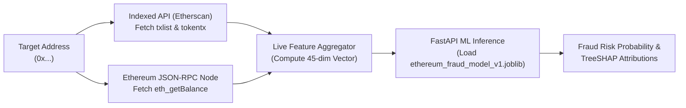

# Ethereum Feature Compatibility & Live Ingestion Analysis

This document provides a critical engineering bridge between the offline machine learning model (trained on the Kaggle Ethereum Fraud Detection dataset) and the planned live Ethereum on-chain ingestion pipeline.

---

## 1. The Core Ingestion Challenge

A fundamental trap in blockchain analytics is assuming that a model trained on historical dataset tables can directly accept live Ethereum RPC queries. 

Standard Ethereum JSON-RPC nodes (`eth_getBalance`, `eth_getBlockByNumber`) **do not index transactions by account address**. Therefore, feature vectors must be generated by aggregating historical transaction arrays acquired from **Indexed APIs (Etherscan, Alchemy Enhanced APIs, or The Graph)**.

---

## 2. Feature Mapping & Live Feasibility Matrix

The trained XGBoost model evaluates **45 numeric behavioral features**. Below is the audit of each feature category, its computational feasibility, and live data source:

### Category A: Direct Transaction Statistics (High Feasibility via Etherscan `txlist`)
| Feature Name | Source | Live Feasibility | Notes |
| :--- | :--- | :--- | :--- |
| `Sent tnx` | `api.etherscan.io?action=txlist` | **Available** | Count of transactions where `from == target_address`. |
| `Received Tnx` | `api.etherscan.io?action=txlist` | **Available** | Count of transactions where `to == target_address`. |
| `Number of Created Contracts` | `api.etherscan.io?action=txlist` | **Available** | Count of transactions where `to == ""` or contract creation bytecode exists. |
| `Unique Received From Addresses` | `api.etherscan.io?action=txlist` | **Available** | `len(set(incoming_addresses))`. |
| `Unique Sent To Addresses` | `api.etherscan.io?action=txlist` | **Available** | `len(set(outgoing_addresses))`. |
| `total transactions` | `api.etherscan.io?action=txlist` | **Available** | Sum of sent, received, and contract creations. |

### Category B: Value & Transfer Aggregations (High Feasibility)
| Feature Name | Source | Live Feasibility | Notes |
| :--- | :--- | :--- | :--- |
| `min value received` | `txlist` | **Available** | Denominated in Ether (`value / 1e18`). |
| `max value received` | `txlist` | **Available** | Maximum incoming Ether value. |
| `avg val received` | `txlist` | **Available** | Mean incoming Ether value. |
| `total ether received` | `txlist` | **Available** | Sum of all received Ether. |
| `min val sent` | `txlist` | **Available** | Minimum outgoing Ether value. |
| `max val sent` | `txlist` | **Available** | Maximum outgoing Ether value. |
| `avg val sent` | `txlist` | **Available** | Mean outgoing Ether value. |
| `total Ether sent` | `txlist` | **Available** | Sum of all sent Ether. |
| `total ether balance` | `eth_getBalance` | **Available** | Real-time wallet balance via Ethers.js. |

### Category C: Temporal & Velocity Features (High Feasibility)
| Feature Name | Source | Live Feasibility | Notes |
| :--- | :--- | :--- | :--- |
| `Time Diff between first and last (Mins)` | `txlist` | **Available** | `(last_tx_timestamp - first_tx_timestamp) / 60`. Highly predictive for fraud. |
| `Avg min between sent tnx` | `txlist` | **Available** | Mean delta between successive outgoing timestamps. |
| `Avg min between received tnx` | `txlist` | **Available** | Mean delta between successive incoming timestamps. |

### Category D: ERC-20 Token Transfers (Moderate Feasibility via Etherscan `tokentx`)
| Feature Name | Source | Live Feasibility | Notes |
| :--- | :--- | :--- | :--- |
| `Total ERC20 tnxs` | `api.etherscan.io?action=tokentx` | **Available** | Total count of ERC-20 transfer event logs for target. |
| `ERC20 total Ether received` | `tokentx` | **Available** | Token transfer volumes normalized by token decimals. |
| `ERC20 total ether sent` | `tokentx` | **Available** | Outgoing token volume. |
| `ERC20 uniq sent addr` | `tokentx` | **Available** | Unique recipient addresses for token transfers. |
| `ERC20 uniq rec addr` | `tokentx` | **Available** | Unique sender addresses for token transfers. |
| `ERC20 uniq rec contract addr` | `tokentx` | **Available** | Count of unique token contracts interacted with. |

### Category E: Constant Features Dropped by Variance Filter (Zero Impact on Live Model)
The following features in the Kaggle dataset had **zero variance across all rows** and were filtered out by `VarianceThreshold`:
- `ERC20 avg time between sent tnx`
- `ERC20 avg time between rec tnx`
- `ERC20 avg time between rec 2 tnx`
- `ERC20 avg time between contract tnx`
- `ERC20 min val sent contract`
- `ERC20 max val sent contract`
- `ERC20 avg val sent contract`

Because they were eliminated during training, the live pipeline **does not need to compute them**, significantly reducing live ingestion latency.

---

## 3. Safe Live Pipeline Architecture (Stage 4 & 5 Roadmap)

### Safety Guarantees:
1. **Never substitute missing features with random values**: If an address is newly created (0 transactions), a deterministic "Zero-History / Insufficient Data" tier will be returned rather than passing false zeros to the classifier.
2. **Deterministic Units**: All value fields must strictly be scaled from Wei (`1e18`) to Ether before inference.
3. **Model Decoupling**: The model predicts statistical probability of fraud based on historical patterns, which the frontend displays as an investigative indicator, not as proof of fraud.
